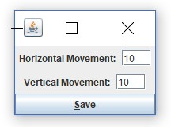

# Mouse Breaker

Move your mouse with the arrow keys on the keyboard.

- Even works without focus.
- The number of pixels that the cursor moves for each key press can be set.

## Installation

Built by NetBeans 8.2 (whole repository is the NetBeans project). Requires jnativehook library.

## Contribution

Feel free to contribute.

## Distribution

You can distribute this software (jar file in the dist folder) freely under GNU GPL v3.0.
